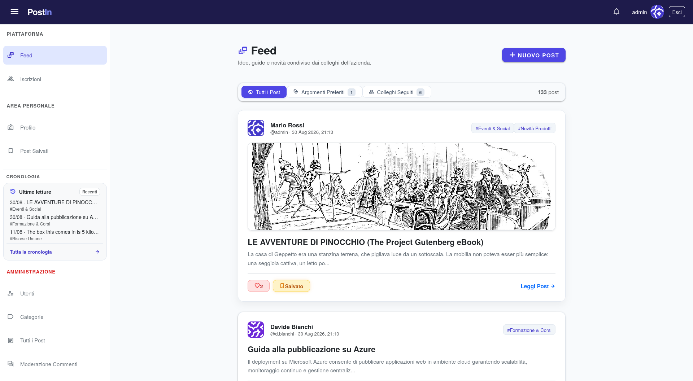
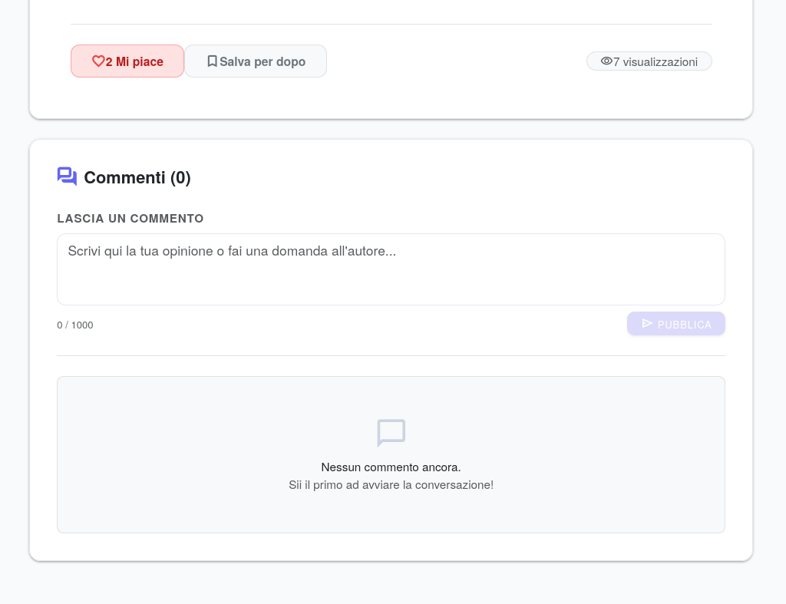
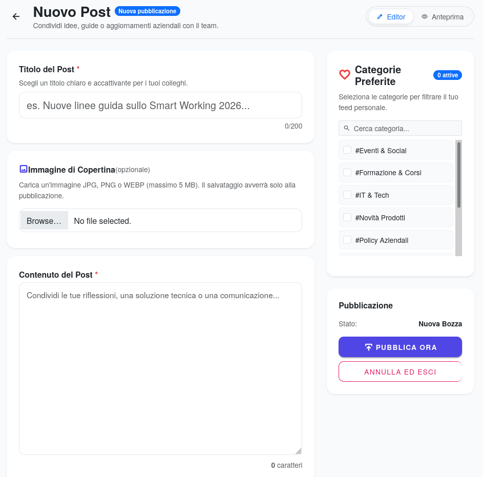
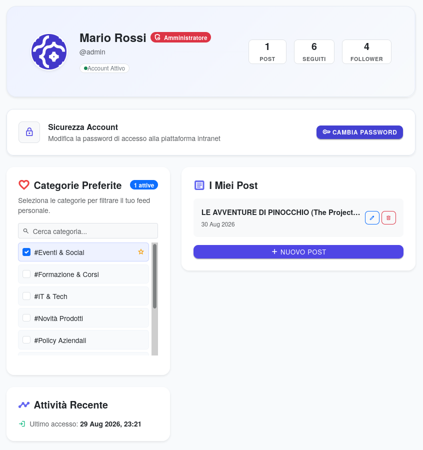
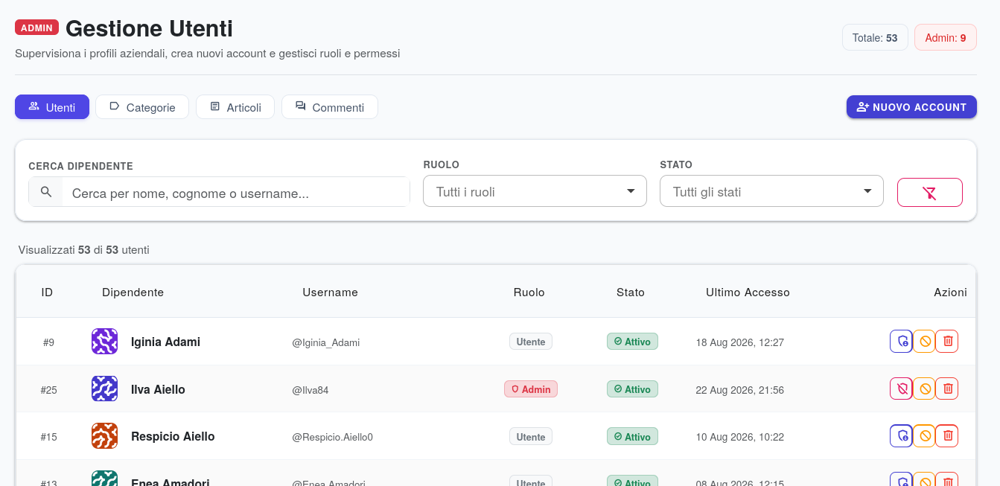

# PostIn — Portale Intranet per la Condivisione della Conoscenza Aziendale

Progetto per l'esame di **Laboratorio di Programmazione Web II**.  
Applicazione web sviluppata in **Microsoft Blazor Server (.NET 9)** con **Entity Framework Core** e **Radzen Blazor**, progettata per la gestione e condivisione di contenuti e conoscenze in ambiente intranet aziendale.

---

## Anteprima dell'Applicazione

- **Home / Feed Principale:**  
  

- **Dettaglio Articolo e Interazioni:**  
  

- **Creazione e Redazione Post:**  
  

- **Profilo Utente e Categorie Preferite:**  
  

- **Pannello di Amministrazione (Radzen DataGrid):**  
  

---

## Caso d'Uso e Funzionalità Principali

**PostIn** è una piattaforma intranet di *Knowledge Sharing* che permette ai dipendenti aziendali di pubblicare articoli, seguire colleghi e personalizzare la propria fruizione dei contenuti.

### Funzionalità Utente Base
- **Feed Dinamico**: Consultazione tramite filtri *Tutti i Post*, *Argomenti Preferiti* (basati sulle proprie categorie) e *Colleghi Seguiti*.
- **Pubblicazione & Copertine**: Creazione e modifica di post con categorie tematiche e upload di immagini di copertina.
- **Interazioni Social**: Rilascio di "Mi piace", salvataggio nella lista privata *"Da leggere dopo"* e pubblicazione di commenti.
- **Tracking & History**: Registrazione automatica della cronologia letture con data e ora di consultazione.
- **Network Colleghi**: Sistema di *Follow/Unfollow* per seguire la produzione dei colleghi.

### Funzionalità Amministratore (Admin)
- **Gestione Dipendenti**: Modifica dello stato dell'account (*Abilitato/Disabilitato*) e del ruolo (*Utente/Admin*).
- **Gestione Categorie**: Inserimento, modifica ed eliminazione delle categorie ufficiali.
- **Moderazione Contenuti**: Gestione e rimozione centralizzata di articoli e commenti tramite griglie `RadzenDataGrid`.

---

## Architettura e Tecnologie

- **Framework Web**: **Blazor Server (.NET 9)** in Interactive Server Mode (comunicazione client-server via SignalR WebSocket).
- **Database & ORM**: **SQLite** gestito tramite **Entity Framework Core** (10 entità relazionali, tabelle di snodo N:M e vincoli d'integrità referenziale).
- **Autenticazione**: Autenticazione a cookie (`AddCookie`) con hashing sicuro delle password mediante `PasswordHasher<Dipendente>`.
- **Interfaccia Utente**: **Radzen Blazor UI** per componenti avanzati (`RadzenDataGrid`, `RadzenDropDown`, `RadzenDatePicker`, `NotificationService`, `DialogService`).
- **Generazione Dati Mock**: **Bogus** per il popolamento automatico (seeding) del database in fase di test ed esame.

---

## Pacchetti NuGet Installati

Elenco completo dei pacchetti definiti nel file di progetto `PostIn.csproj`:

| Pacchetto | Versione | Descrizione / Ruolo nel Progetto |
| :--- | :--- | :--- |
| `Microsoft.EntityFrameworkCore` | `9.0.0` | ORM principale per la mappatura e gestione dei dati C# |
| `Microsoft.EntityFrameworkCore.Sqlite` | `9.0.0` | Provider EF Core per il database SQLite |
| `Microsoft.EntityFrameworkCore.Tools` | `9.0.0` | Strumenti CLI per la creazione e applicazione delle migrazioni |
| `Microsoft.EntityFrameworkCore.Design` | `9.0.0` | Componenti per la generazione dello schema e supporto al design |
| `Radzen.Blazor` | `11.2.2` | Libreria UI con tabelle interattive, ordinamento, filtri e dialoghi |
| `Bogus` | `35.6.5` | Generatore di dati fittizi realistici per il seed iniziale (`DbSeeder.cs`) |

---

## Comandi Utilizzati per la Realizzazione

Tutti i comandi eseguiti da riga di comando (CLI) durante le fasi di creazione, configurazione e sviluppo:

### 1. Inizializzazione del Progetto
```bash
# Creazione del progetto Blazor con modalità Server Interattiva
dotnet new blazor -n PostIn --interactivity Server

# Spostamento nella cartella del progetto
cd PostIn
```

### 2. Installazione delle Dipendenze NuGet
```bash
dotnet add package Microsoft.EntityFrameworkCore --version 9.0.0
dotnet add package Microsoft.EntityFrameworkCore.Sqlite --version 9.0.0
dotnet add package Microsoft.EntityFrameworkCore.Tools --version 9.0.0
dotnet add package Microsoft.EntityFrameworkCore.Design --version 9.0.0
dotnet add package Radzen.Blazor --version 11.2.2
dotnet add package Bogus --version 35.6.5
```

### 3. Gestione delle Migrazioni ed Evoluzione DB (EF Core CLI)
```bash
# Creazione della migrazione iniziale basata sull'ApplicationDbContext
dotnet ef migrations add InitialCreate

# Applicazione delle migrazioni al database SQLite (generazione del file postin.db)
dotnet ef database update
```

### 4. Ripristino, Build ed Esecuzione Locale
```bash
# Ripristino dei pacchetti NuGet
dotnet restore

# Compilazione dell'applicazione
dotnet build

# Avvio dell'applicazione
dotnet run
```

---

## Metodologia d'Uso dell'IA (GitHub Copilot e Gemini)

In conformità con le direttive del corso di *Laboratorio di Programmazione Web II*, gli strumenti di supporto basati su intelligenza artificiale (**GitHub Copilot / Assistenti LLM**) sono stati impiegati come affiancamento allo sviluppo per:

- **Brainstorming e ideazione delle funzionalità:** Supporto concettuale nella definizione dei flussi applicativi, nell'esplorazione di soluzioni UI/UX e nella strutturazione delle feature (es. logica di moderazione utenti, gestione delle categorie, interfacce di navigazione).
- **Spiegazioni tecniche e consultazione rapida:** Approfondimento delle funzionalità del framework, chiarimento di scelte architetturali e comprensione dei componenti e della gestione dello stato.
- **Scaffolding e generazione di codice boilerplate:** Creazione preliminare dello scheletro delle entità del dominio, dei DTO e della struttura ripetitiva dei componenti Razor.
- **Refactoring e ottimizzazione dei form:** Uniformazione dei componenti di input e gestione dello stato della pagina.
- **Personalizzazione e rifinitura del frontend (Bootstrap):** Supporto nell'adattamento, override del layout e personalizzazione stilistica di classi e componenti Bootstrap.
- **Debugging e analisi delle performance di Entity Framework Core:** Diagnostica e risoluzione di warning/errori complessi del motore di query, come l'avviso `EntityFrameworkCore.Query[20504]` relativo all'**esplosione cartesiana** (*Cartesian Explosion*) causata da `Include()` multipli contemporanei su collezioni correlate (`ArticoloCategorie`, `Commenti`, `Visualizzazioni`, `Likes`), risolto mediante scomposizione o l'utilizzo strategico di `AsSplitQuery()`.
- **Redazione e revisione della documentazione tecnica:** Supporto nella riscrittura, correzione stilistica e strutturazione dei documenti di progetto e del README.

> **Nota:** *Ogni porzione di codice, query o suggerimento architetturale proposto dall'IA è stato preventivamente compreso, revisionato e validato manualmente per garantire il pieno rispetto dei vincoli relazionali, della sicurezza dell'applicazione e della coerenza architetturale complessiva.*
