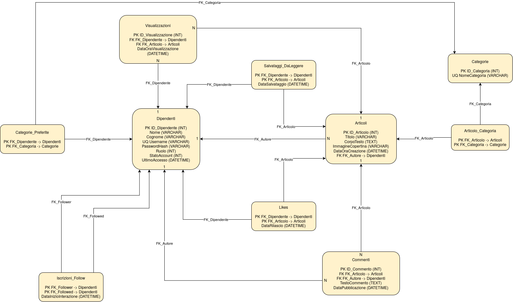

# Modello dei Dati e Architettura Database (Entity Framework Core)
---
>Il presente documento descrive in dettaglio la modellazione concettuale e relazionale del database per la piattaforma **PostIn**, implementata tramite **Entity Framework Core**.
---

---
## 1. Codici e Convenzioni di Dominio
Nel modello applicativo, la gestione dei ruoli e degli stati degli account utente è implementata tramite valori numerici interi (`int`):

**1.1 Codici Ruolo (`Ruolo` : int)**
* **0** = Utente Base (collaboratore standard con permessi di lettura, scrittura post, commenti e interazioni)
* **1** = Amministratore (accesso alle pagine di moderazione e gestione categorie/utenti)

**1.2 Codici Stato Account (`StatoAccount` : int)**
* **1** = Attivo (utenza abilitata all'accesso)
* **0** / **2** = Disabilitato / Sospeso

---

## 2. Struttura delle Entità e Modello Relazionale

### 2.1 Dipendente
Rappresenta l'anagrafica e le credenziali di accesso del collaboratore aziendale.
* **Chiave Primaria:** `ID_Dipendente` (int, Identity / Autoincrement)
* **Attributi:**
  * `Nome` (string, Obbligatorio - inizializzato a `string.Empty`)
  * `Cognome` (string, Obbligatorio - inizializzato a `string.Empty`)
  * `Username` (string, Obbligatorio - Indice UNIQUE configurato in DbContext)
  * `PasswordHash` (string, Obbligatorio - inizializzato a `string.Empty`)
  * `Ruolo` (int, Default: 0)
  * `StatoAccount` (int, Default: 0)
  * `UltimoAccesso` (DateTime?, Nullable)
* **Proprietà di Navigazione / Relazioni:**
  * **1:N** con Articolo tramite `Articoliscritti` (Autore)
  * **1:N** con Commento tramite `Commenti`
  * **1:N** con Visualizzazione tramite `Visualizzazioni`
  * **N:M** con Articolo tramite la tabella di snodo *Like* (collezione `Likes` di tipo `Articolo`)
  * **N:M** con Articolo tramite la tabella di snodo *SalvataggioDaLeggere* (collezione `ArticoliSalvati` di tipo `Articolo`)
  * **N:M** con Categoria tramite la tabella di snodo *CategoriaPreferita* (collezione `CategoriePreferite` di tipo `Categoria`)
  * **1:N** verso la tabella di snodo *IscrizioniFollow* (collezioni `Following` e `Followers`), per gestire l'N:M riflessiva.

### 2.2 Articolo
Rappresenta il post o contenuto aziendale pubblicato sul portale.
* **Chiave Primaria:** `ID_Articolo` (int, Identity / Autoincrement)
* **Chiavi Esterne:**
  * `FK_Autore` $\rightarrow$ `Dipendente.ID_Dipendente` (`DeleteBehavior.Restrict`)
* **Attributi:**
  * `Titolo` (string, Obbligatorio - inizializzato a `string.Empty`)
  * `CorpoTesto` (string, Obbligatorio - inizializzato a `string.Empty`)
  * `ImmagineCopertina` (string?, Nullable)
  * `DataOraCreazione` (DateTime, Default: `DateTime.UtcNow`)
* **Proprietà di Navigazione / Relazioni:**
  * **1:N** verso la tabella di snodo *ArticoloCategoria* (collezione `ArticoloCategorie`)
  * **1:N** con Commento tramite `Commenti`
  * **1:N** con Visualizzazione tramite `Visualizzazioni`
  * **N:M** con Dipendente tramite la tabella di snodo *Like* (collezione `Likes` di tipo `Dipendente`)
  * **N:M** con Dipendente tramite la tabella di snodo *SalvataggioDaLeggere* (collezione `SalvataggiDaLeggere` di tipo `Dipendente`)

### 2.3 Categoria
Rappresenta le categorie tematiche o hashtag per classificare gli articoli.
* **Chiave Primaria:** `ID_Categoria` (int, Identity / Autoincrement)
* **Attributi:**
  * `NomeCategoria` (string, Obbligatorio - Indice UNIQUE configurato in DbContext)
* **Proprietà di Navigazione / Relazioni:**
  * **1:N** verso la tabella di snodo *ArticoloCategoria* (collezione `ArticoloCategorie`)
  * **N:M** con Dipendente tramite la tabella di snodo *CategoriaPreferita* (collezione `CategoriePreferite` di tipo `Dipendente`)

### 2.4 ArticoloCategoria (Tabella di Snodo N:M)
Associa ciascun articolo a una o più categorie tematiche.
* **Chiave Primaria Composta:** (`FK_Articolo`, `FK_Categoria`)
* **Chiavi Esterne:**
  * `FK_Articolo` $\rightarrow$ `Articolo.ID_Articolo` (`DeleteBehavior.Cascade`)
  * `FK_Categoria` $\rightarrow$ `Categoria.ID_Categoria` (`DeleteBehavior.Cascade`)

### 2.5 CategoriaPreferita (Tabella di Snodo N:M implicita e custom)
Memorizza le categorie di interesse selezionate da ciascun dipendente. Gestita con `UsingEntity` nel DbContext.
* **Chiave Primaria Composta:** (`FK_Dipendente`, `FK_Categoria`)
* **Chiavi Esterne:**
  * `FK_Dipendente` $\rightarrow$ `Dipendente.ID_Dipendente` (`DeleteBehavior.Cascade`)
  * `FK_Categoria` $\rightarrow$ `Categoria.ID_Categoria` (`DeleteBehavior.Cascade`)

### 2.6 IscrizioniFollow (Tabella di Snodo N:M Riflessiva)
Gestisce le relazioni di follow tra dipendenti all'interno della rete intranet aziendale.
* **Chiave Primaria Composta:** (`FK_Follower`, `FK_Followed`)
* **Chiavi Esterne:**
  * `FK_Follower` $\rightarrow$ `Dipendente.ID_Dipendente` (Utente seguitore, `DeleteBehavior.Cascade`)
  * `FK_Followed` $\rightarrow$ `Dipendente.ID_Dipendente` (Utente seguito, `DeleteBehavior.Cascade`)
* **Attributo Temporale:**
  * `DataInizioInterazione` (DateTime, Default: `DateTime.UtcNow`)
* **Vincolo SQL:**
  * `CHECK ("FK_Follower" <> "FK_Followed")` vincolo di integrità (`CK_IscrizioniFollow_NoSelfFollow`) configurato per impedire l'autofollow.

### 2.7 SalvataggioDaLeggere (Tabella di Snodo N:M)
Rappresenta l'elenco privato degli articoli salvati da un dipendente per la lettura differita. Gestita con `UsingEntity` nel DbContext.
* **Chiave Primaria Composta:** (`FK_Dipendente`, `FK_Articolo`)
* **Chiavi Esterne:**
  * `FK_Dipendente` $\rightarrow$ `Dipendente.ID_Dipendente` (`DeleteBehavior.Cascade`)
  * `FK_Articolo` $\rightarrow$ `Articolo.ID_Articolo` (`DeleteBehavior.Cascade`)
* **Attributo Temporale:**
  * `DataSalvataggio` (DateTime, Default: `DateTime.UtcNow`)

### 2.8 Like (Tabella di Snodo N:M)
Gestisce i "Mi piace" assegnati dai dipendenti agli articoli. Gestita con `UsingEntity` nel DbContext.
* **Chiave Primaria Composta:** (`FK_Dipendente`, `FK_Articolo`)
* **Chiavi Esterne:**
  * `FK_Dipendente` $\rightarrow$ `Dipendente.ID_Dipendente` (`DeleteBehavior.Cascade`)
  * `FK_Articolo` $\rightarrow$ `Articolo.ID_Articolo` (`DeleteBehavior.Cascade`)
* **Attributo Temporale:**
  * `DataRilascio` (DateTime, Default: `DateTime.UtcNow`)

### 2.9 Visualizzazione
Registra le aperture e letture degli articoli per le metriche statistiche.
* **Chiave Primaria:** `ID_Visualizzazione` (int, Identity / Autoincrement)
* **Chiavi Esterne:**
  * `FK_Dipendente` $\rightarrow$ `Dipendente.ID_Dipendente` (`DeleteBehavior.Cascade`)
  * `FK_Articolo` $\rightarrow$ `Articolo.ID_Articolo` (`DeleteBehavior.Cascade`)
* **Attributo Temporale:**
  * `DataOraVisualizzazione` (DateTime, Default: `DateTime.UtcNow`)

### 2.10 Commento
Memorizza i commenti pubblicati dagli utenti sotto gli articoli.
* **Chiave Primaria:** `ID_Commento` (int, Identity / Autoincrement)
* **Chiavi Esterne:**
  * `FK_Articolo` $\rightarrow$ `Articolo.ID_Articolo` (`DeleteBehavior.Cascade`)
  * `FK_Autore` $\rightarrow$ `Dipendente.ID_Dipendente` (`DeleteBehavior.Restrict` per impedire cicli di cancellazione multipli)
* **Attributi:**
  * `TestoCommento` (string, Obbligatorio - inizializzato a `string.Empty`)
  * `DataPubblicazione` (DateTime, Default: `DateTime.UtcNow`)

---

## 3. Mappa Sintetica delle Relazioni

| Entità Origine | Entità Destinazione | Cardinalità | Tabella di Snodo / FK           | Delete Behavior | Descrizione / Scopo                                                                 |
| :------------- | :------------------ | :---------- | :------------------------------ | :-------------- | :---------------------------------------------------------------------------------- |
| **Dipendente** | **Articolo**        | 1:N         | `Articolo.FK_Autore`            | **Restrict**    | Un dipendente scrive molti articoli; impedisce la cancellazione orfana dell'autore. |
| **Dipendente** | **Commento**        | 1:N         | `Commento.FK_Autore`            | **Restrict**    | Un dipendente scrive molti commenti; previene percorsi di cascade ciclici.          |
| **Dipendente** | **Visualizzazione** | 1:N         | `Visualizzazione.FK_Dipendente` | Cascade         | Storico visualizzazioni effettuate dall'utente.                                     |
| **Articolo**   | **Commento**        | 1:N         | `Commento.FK_Articolo`          | Cascade         | I commenti appartengono a un articolo e si eliminano con esso.                      |
| **Articolo**   | **Visualizzazione** | 1:N         | `Visualizzazione.FK_Articolo`   | Cascade         | Metriche di lettura del singolo post.                                               |
| **Articolo**   | **Categoria**       | N:M         | `ArticoloCategoria`             | Cascade         | Tagging e categorizzazione multipla degli articoli.                                 |
| **Dipendente** | **Categoria**       | N:M         | `CategoriaPreferita`            | Cascade         | Preferenze categorie per personalizzazione feed.                                    |
| **Dipendente** | **Dipendente**      | N:M         | `IscrizioniFollow`              | Cascade         | Rete sociale aziendale (Followers / Following con check anti-autofollow).           |
| **Dipendente** | **Articolo**        | N:M         | `SalvataggioDaLeggere`          | Cascade         | Segnalibri / lettura post differita (Read-later).                                   |
| **Dipendente** | **Articolo**        | N:M         | `Like`                          | Cascade         | Gradimento e reazioni ai contenuti.                                                 |

