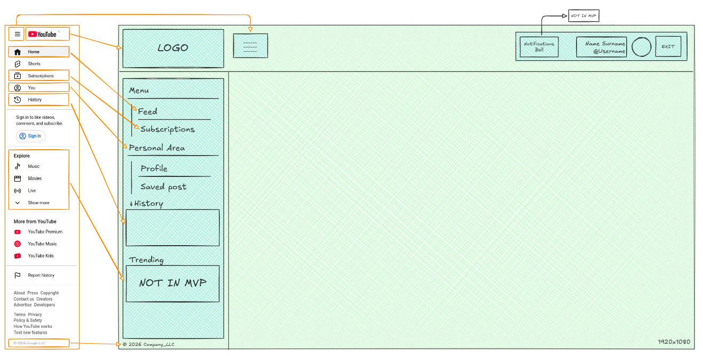

# UX UI
---
>Il presente documento descrive in dettaglio le barre di navigazione della piattaforma **PostIn**, le scelte di design adottate e il comportamento atteso di ciascun elemento dell'interfaccia.
---

> [!NOTE]
> **MVP** = Minimum Viable Product

---
## La Top Bar (Barra Superiore Fissa)

La Top Bar è la barra orizzontale sempre visibile nella parte superiore dello schermo. Rimane fissa durante lo scorrimento della pagina e ha lo scopo di fornire accesso immediato alle funzioni globali dell'applicazione.

È composta da tre elementi principali disposti orizzontalmente:
- **Pulsante hamburger:** Posizionato all'estrema sinistra, apre e chiude il Side Panel laterale. Su dispositivi mobili il pannello si sovrappone al contenuto con uno sfondo scuro (backdrop); su desktop scivola in entrata e uscita senza coprire il contenuto.
- **Logo PostIn:** Affianca il pulsante hamburger e funge anche da link rapido alla pagina principale del feed.
- **Area utente (destra):** Contiene tre elementi:
    - **Campanella notifiche (Non MVP):** Icona a forma di campana. In una versione futura mostrerà un badge con il numero di notifiche non lette (like, commenti, nuovi follower). Nella versione attuale il pulsante è presente graficamente ma non è ancora collegato a nessuna funzionalità.
    - **Nome utente e avatar:** Mostrano lo username dell'utente autenticato e la relativa immagine Gravatar.
    - **Pulsante "Esci":** Esegue il logout e reindirizza alla pagina di Login.

---
## Il Side Panel (Barra di Navigazione Laterale)

Il Side Panel è il menu principale che permette di muoversi facilmente all'interno della piattaforma. Le varie funzioni sono organizzate in macro-aree separate da titoli molto chiari. Questa scelta di design serve a rendere la navigazione intuitiva e rapida.

La voce attiva viene evidenziata con uno sfondo viola chiaro e il testo in grassetto, così l'utente sa sempre in quale sezione si trova.

La barra è divisa in quattro macro-aree:
- **Piattaforma:** Contiene le voci di navigazione globale:
    - **Feed** mostra tutti i post pubblicati in azienda, con filtri per argomenti preferiti e colleghi seguiti.
    - **Iscrizioni** porta alla pagina del network personale, dove gestire i colleghi seguiti e visualizzare i propri follower.
- **Area Personale:** Spazio dedicato al singolo dipendente:
    - **Profilo** accesso al proprio profilo, statistiche di pubblicazione e gestione delle categorie preferite.
    - **Post Salvati** lista degli articoli salvati per essere letti in un secondo momento.
- **Cronologia:** Widget compatto sempre visibile nel pannello. Mostra l'orario (o la data, se il post è stato letto in un giorno precedente) e il titolo degli ultimi **tre articoli letti** in modo deduplicato se lo stesso post è stato aperto più volte, compare una sola volta. In fondo al widget è presente il link **"Tutta la cronologia"** che porta alla pagina `/history` con l'elenco completo raggruppato per giorno.
- **In Tendenza (Non MVP):** Piccola classifica con i tre argomenti o articoli più discussi del momento, calcolata in base al numero di like, commenti e visualizzazioni nelle ultime 24 ore. Questa sezione è prevista nel design ma non è implementata nella versione corrente.

---
## Sezione Amministrazione (solo Admin)

Visibile esclusivamente agli utenti con ruolo **Admin**, appare in fondo al Side Panel separata da un bordo rosso. Contiene le scorciatoie al pannello di controllo:

- **Utenti** gestione degli account dipendenti.
- **Categorie** creazione e modifica degli hashtag tematici.
- **Tutti i Post** moderazione e analisi di tutti gli articoli pubblicati.
- **Moderazione Commenti** supervisione e rimozione dei commenti.

---

## Comportamento Responsive

| Contesto    | Comportamento                                                                                                                                                                                      |
| ----------- | -------------------------------------------------------------------------------------------------------------------------------------------------------------------------------------------------- |
| **Desktop** | Il Side Panel è aperto di default e può essere chiuso/riaperto con il pulsante hamburger. Il contenuto principale si ridimensiona di conseguenza.                                                  |
| **Mobile**  | Il Side Panel è chiuso di default. All'apertura si sovrappone al contenuto con un backdrop scuro semitrasparente. Un click sul backdrop o su una voce del menu chiude il pannello automaticamente. |
